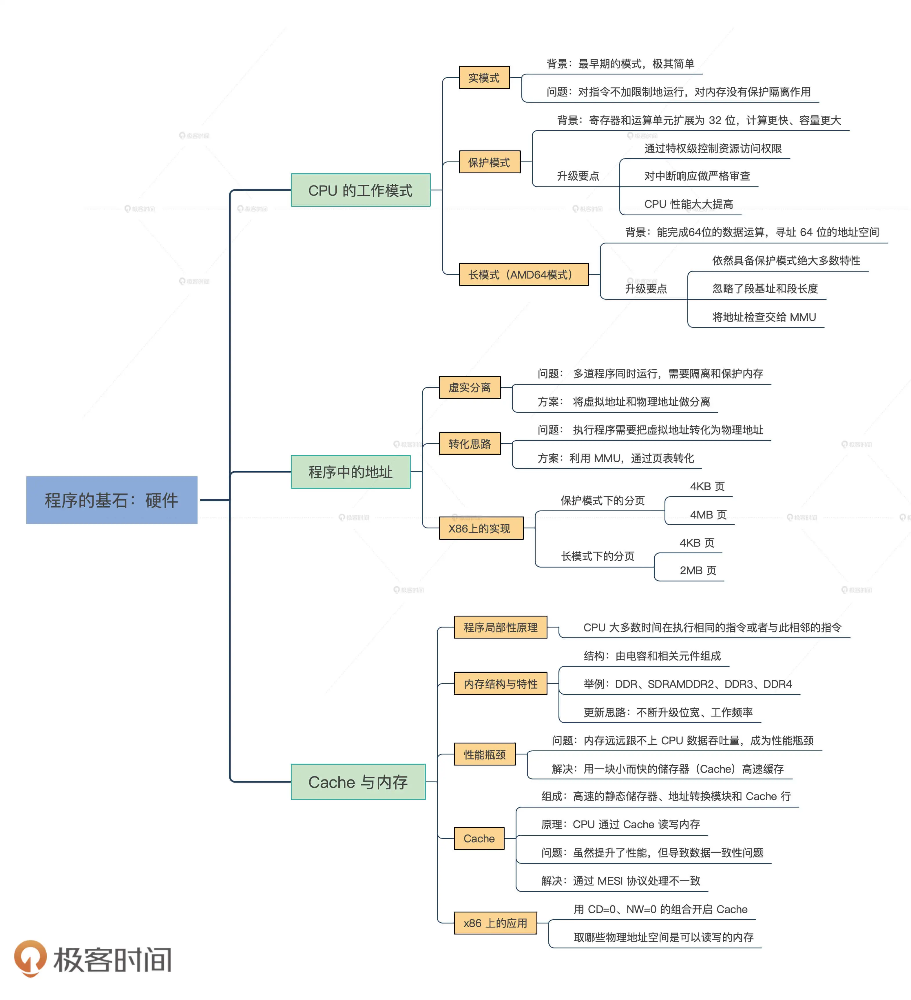

# 第3章 程序的基石：硬件

## 第5讲 CPU工作模式：执行程序的三种模式

### 1 实模式

- 概念：运行真实的指令，发往内存的地址是真实的，对任何地址不加限制地发完内存

- 实模式寄存器：包括通用寄存器、程序指针寄存器、栈指针寄存器、段寄存器、CPU标志寄存器

  |           寄存器           |                        描述                        |
  | :------------------------: | :------------------------------------------------: |
  | AX、BX、CX、DX、DI、SI、BP |     通用寄存器，里面可以存放数据、地址参与运算     |
  |             IP             |      程序指针寄存器，始终指向下一条指令的地址      |
  |             SP             |           栈指针寄存器，始终指向当前栈顶           |
  |       CS、DS、ES、SS       |        段寄存器，里面存放一个内存段的基地址        |
  |           FLAGS            | CPU标志寄存器，里面存放CPU执行运算指令产生的状态位 |

- 实模式下访问内存：代码段由CS和IP确定，栈段由SS和SP确定
- 实模式中断：可分为硬件中断（中断控制器给CPU发送一个电子信号）、软件中断（CPU执行INT指令）
- 中断向量表：表的地址和长度由CPU的特定寄存器IDTR指向，由代码段地址和段内偏移组成
- 软件中断过程：基于中断向量表，当CPU收到INT指令后，根据IDTR寄存器中的信息，计算中断向量中的条目，装载CS（装入代码段基地址）、IP（装入代码段内偏移）寄存器，最终响应中断。

### 2 保护模式

- 保护模式寄存器：包括32位通用寄存器、32位程序指针寄存器、栈指针寄存器、16位段寄存器、32位CPU标志寄存器、32位CPU控制寄存器

|              寄存器               |                            描述                            |
| :-------------------------------: | :--------------------------------------------------------: |
| EAX、EBX、ECX、EDX、EDI、ESI、EBP |       32位通用寄存器，里面可以存放数据、地址参与运算       |
|                EIP                |        32位程序指针寄存器，始终指向下一条指令的地址        |
|                ESP                |               栈指针寄存器，始终指向当前栈顶               |
|      CS、DS、ES、SS、FS、GS       |          16位段寄存器，里面存放一个内存段的基地址          |
|              EFLAGS               |   32位CPU标志寄存器，里面存放CPU执行运算指令产生的状态位   |
|        CR0、CR1、CR2、CR3         | 32位CPU控制寄存器，控制CPU的功能控制特性，如开启保护模式等 |

- 保护模式特权级：分为4级，从R0到R3依次递减
- 保护模式段描述符：有64位8字节数据，里面包含了段基地址、段长度、段权限、段类型（可以是系统段、代码段、数据段）、段是否可读写，可执行等。
- 全局段描述符表：表的基地址和长度由CPU和GDTR寄存器表示，段寄存器中不再存放段基地址，而是存放具体段描述符的索引
- 保护模式段选择子：由影子寄存器、段描述符索引、描述符表索引、权限级别组成，通过影子寄存器实现一个段描述符的高速缓存
- 保护模式的平坦模型：将所有段的基地址都设置为0，段的长度设置为0xffff，段长度的粒度为4KB，所有段都指向同一个字节大小的地址空间，使“分段”成为一种“虚设”
- 保护模式中断
    1. CPU检查中断号是否大于最后一个中断门描述符（0~255）
    2. 检查描述符类型，是中断门还是陷阱门，是否为系统描述符，是否存在内存中
    3. 检查中断门描述符中的段选择子指向的段描述符
    4. 权限检查
    5. CPU加载中断门描述符中的目标代码段选择子到CS寄存器，把目标代码段偏移加载到EIP寄存器中
- 切换到保护模式
    1. 准备全局段描述符表
    2. 加载设置GDTR寄存器，指向全局段描述符表
    3. 设置CR0寄存器，开启保护模式
    4. 进行长跳转，加载CS段寄存器

### 3 长模式

- 长模式寄存器：包括64位通用寄存器、64位程序指针寄存器、栈指针寄存器、16位段寄存器、64位CPU标志寄存器、64位CPU控制寄存器（CR0是32位）

|                   寄存器                   |                             描述                             |
| :----------------------------------------: | :----------------------------------------------------------: |
| RAX、RBX、RCX、RDX、RDI、RSI、RBP、R8\~R15 |        64位通用寄存器，里面可以存放数据、地址参与运算        |
|                    RIP                     |         64位程序指针寄存器，始终指向下一条指令的地址         |
|                    RSP                     |                栈指针寄存器，始终指向当前栈顶                |
|           CS、DS、ES、SS、FS、GS           |         16位段寄存器，里面存放一个内存段的描述符索引         |
|                   RFLAGS                   |    64位CPU标志寄存器，里面存放CPU执行运算指令产生的状态位    |
|          CR0、CR1、CR2、CR3、CR4           | 除CR0仍是32位CPU控制寄存器，控制CPU的功能控制特性，其它都是64位寄存器 |

- 长模式段描述符：CPU不再对段基址和段长度进行检查，只对DPL进行相关检查
- 切换到长模式：
    1. 准备长模式全局段描述符表
    2. 准备长模式下的MMU页表，用于开启分页模式
    3. 加载GDTR寄存器，指向全局段描述符表
    4. 开启长模式，同时开启保护模式和分页模式
    5. 进行跳转，加载CS段寄存器，刷新其影子寄存器

## 第6讲 虚幻与真实：程序中的地址如何转换？

### 1 虚拟地址和物理地址

- 虚拟地址：由链接器将多个代码组成在一起，形成程序运行的静态内存空间视图
- 物理地址：通过地址译码器变成电子信号，形成地址总线，根据电子信号的各种组合可选择到内存的存储单元，是选择内存单元的地址

### 2 虚拟地址到物理地址的转换

- 分页模型：把虚拟地址空间和物理地址空间都分成同等大小的块，也称为页，按照虚拟页和物理页进行转换，在地址关系转换表中，只需存放虚拟页地址对应的物理页地址即可
- 分页模式特点：灵活性、通用性、安全性

### 3 MMU

- MMU：内存存储单元，负责接受虚拟地址和地址关系转换表，输出物理地址，使用保护模式的平坦模式
- MMU页表：描述了虚拟地址到物理地址的转换关系，将虚拟地址作为索引，查表返回物理页面地址；页面可分为三级：一个顶级页目录，多个中级页目录，最后才是页表
- MMU工作流程：
    1. 第一个位段索引顶级页目录中一个项，该项指向一个中级页目录
    2. 用第二个位段去索引中级页目录中的一个项，该项指向一个页目录
    3. 用第三个位段去索引页目录中的项，该项指向一个物理页地址
    4. 用第四个位段作该物理页内的偏移去访问物理内存

### 4 保护模式下的分页

- 基于4KB页的分页：虚拟地址分为页目录索引（1024个条目）、页表索引（每个页表有1024个条目）、页内偏移（每个物理页4KB）
- 基于4MB页的分页：虚拟地址分为页表索引（1024个条目）、页内偏移（每个物理页4MB）

### 5 长模式下的分页

- 基于4KB页的分页：虚拟地址分为保留位段、顶级页目录索引（512个条目）、页目录指针索引（512个条目）、页目录索引（512个条目）、页表索引（512个条目）、页内偏移（4KB）
- 基于2MB页的分页：虚拟地址分为保留位段、顶级页目录索引（512个条目）、页目录指针索引（512个条目）、页目录索引（512个条目）、页内偏移（2MB）

### 6 MMU的开启步骤

1. 使CPU进入保护模式或者长模式
2. 准备好页表数据，这包含顶级页目录、中间层页目录、页表
3. 把顶级页目录的物理内存地址赋值给CR3寄存器
4. 设置CPU的CR0的PE位为1

### 7 MMU地址转换失败的过程

1. MMU停止转换地址
2. MMU把转换失败的虚拟地址写入CPU的CR2寄存器
3. MMU触发CPU的14号中断，使CPU停止执行当前指令
4. CPU开始执行14号中断的处理代码，代码会检查原因，处理好页表数据返回
5. CPU中断返回继续执行MMU地址转换失败时的指令

## 第7讲 Cache与内存：程序放在哪儿？

### 1 内存与Cache

- 内存：称为DRAM，动态随机存储器，主要由内存颗粒芯片（用于存放数据）、SPD芯片（用于存放自身的容量、频率、厂商等信息）、金手指（用于连接数据总线和地址总线）、电源等
- Cache：高速缓存，存放内存中的一部分数据，主要由高速的静态存储器、地址转换模块和Cache行替换模块组成
- Cache逻辑工作流程：
    1. CPU发出的地址由Cache的地址转换模块分成3段：组号、行号、行内偏移
    2. Cache会根据组号、行号查找高速静态储存器中对应的行：如果找到（命中），用行内偏移读取并返回数据给CPU，否则分配一个新行，把内存对应的数据加载到Cache的行并返回给CPU。分为回写（写入对应Cache行）、直通写（写入Cache行并写入内存）
    3. 如果没有新行，则进行行替换逻辑：找到一个Cache行写回内存，腾出空间

### 2 Cache的数据一致性问题

- 一个CPU核心中的指令Cache和数据Cache的一致性问题
- 多个CPU核心各自的2级Cache的一致性问题
- CPU的3级Cache与设备内存（DMA、网卡帧存储），显存之间的一致性问题

### 3 Cache的MESI协议

- 简介：该协议主要定义了4种基本状态：M（Modified，修改）、E（Exclusive，独占）、S（Shared，共享）、I（Invalid，无效）
- 四种状态：
    1. M（Modified，修改）：当前Cache中的内容有效，数据已经被修改而且与内存中的数据不一致，数据只在当前Cache里存在
    2. E（Exclusive，独占）：当前Cache中的内容有效，数据与内存中的数据一致，数据只在当前Cache里存在
    3. S（Shared，共享）：当前Cache中的内容有效，数据与内存中的数据一致，数据在多个CPU核心中的Cache里面存在
    4. I（Invalid，无效）：当前Cache无效

### 4 开启Cache

只需要将CR0寄存器中CD、NW位同时清0即可
```masm
mov eax, cr0  
;CPU维护内存数据一致性
btr eax,29 ;CR0.NW=0
;开启Cache
btr eax,30 ;CR0.CD=0
mov cr0, eax
```

### 5 获取内存视图

- 获取可读写的内存的物理地址空间的方法：通过BIOS提供的实模式的中断服务`int 15h`，需要先设置特定寄存器
```masm
_getmemmap:
  xor ebx,ebx ;ebx设为0
  mov edi,E80MAP_ADR ;edi设为存放输出结果的1MB内的物理内存地址
loop:
  mov eax,0e820h ;eax必须为0e820h
  mov ecx,20 ;输出结果数据项的大小为20字节：8字节内存基地址，8字节内存长度，4字节内存类型
  mov edx,0534d4150h ;edx必须为0534d4150h
  int 15h    ;执行中断
  jc error   ;如果flags寄存器的C位置1，则表示出错
  add edi,20 ;更新下一次输出结果的地址
  cmp ebx,0  ;如ebx为0，则表示循环迭代结束
  jne loop   ;还有结果项，继续迭代
    ret
error: ;出错处理
```

## 总结

