# QCon2019（广州站）参会总结
## 1 会议时间
2019年5月27日~2019年5月28日

## 2 日程安排
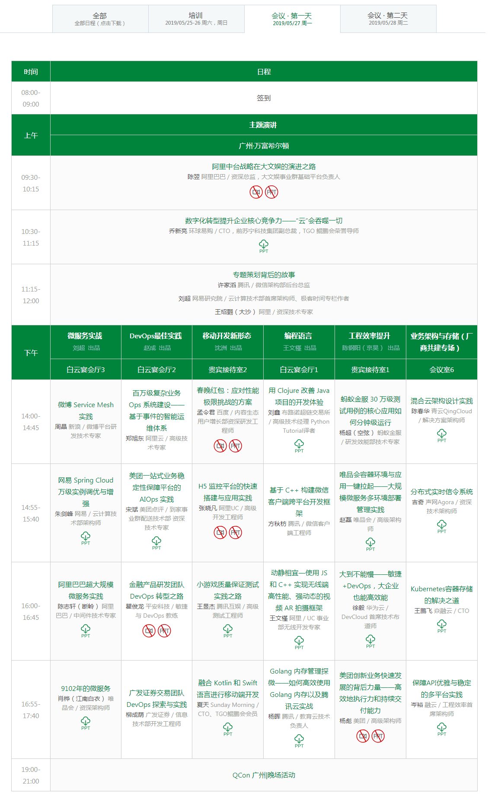
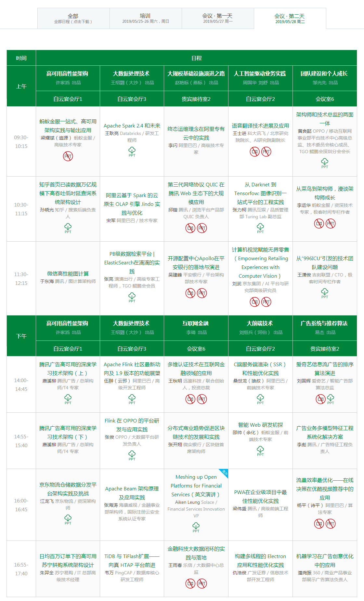

## 3 参加的讲座
第一天：  
- QCon十年回顾：软件正在定义世界
- 阿里中台战略在大文娱的演进之路
- 数字化转型提升企业核心竞争力——“云”会吞噬一切
- 百万级复杂业务Ops系统建设——基于事件的智能运维体系
- 基于C++构建微信客户端跨平台开发框架
- 阿里巴巴超大规模微服务实践
- 9102年的微服务

第二天：  
- 语音翻译技术进展及应用
- 从菜鸟到架构师，漫谈架构师成长
- 计算机视觉赋能无界零售（Empowe-ring Retailing Experiences with Computer Vision）
- 爱奇艺信息流广告的排序算法演进
- 广告业务多模型特征工程系统化解决方案
- 流量效率最优化——在线决策在优酷视频推荐中的应用
- 机器学习在广告创意优化中的应用

## 4 讲座笔记
### 4.1 QCon十年回顾：软件正在定义世界（霍泰稳）
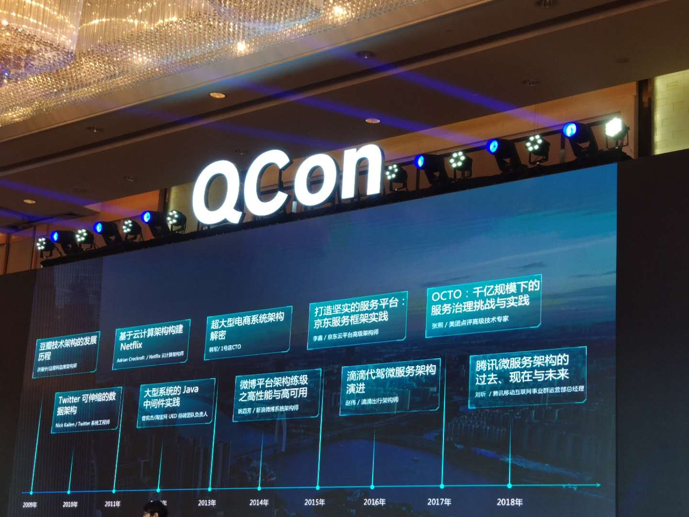
&emsp;&emsp;开篇通过介绍互联网发展和云计算发展，回顾了整个技术历史，之后重点突出“我们正身处于一个波澜壮阔的世界”，“我们为技术的历史留痕”，通过介绍软件行业的三个阶段：PC互联网、移动互联网、产业互联网，最后引出主题——“软件正在改变世界，软件正在定义世界”。在介绍过程中引用了两位名人的话，分别是爱因互动联合创始人兼CEO-洪强宁、比尔·盖茨。
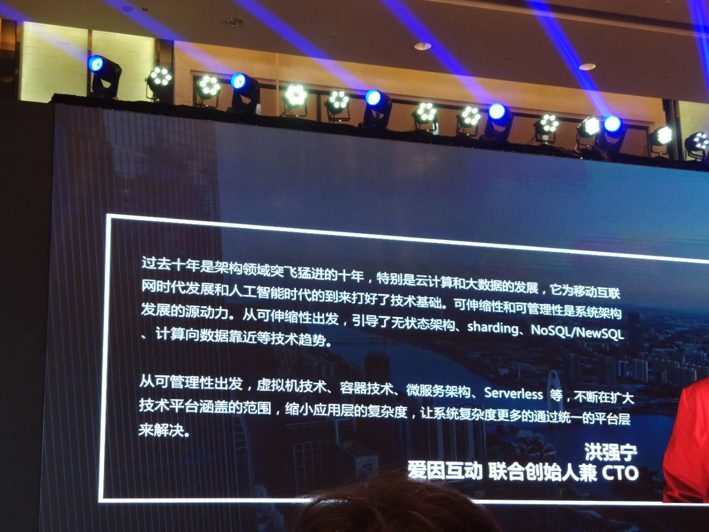
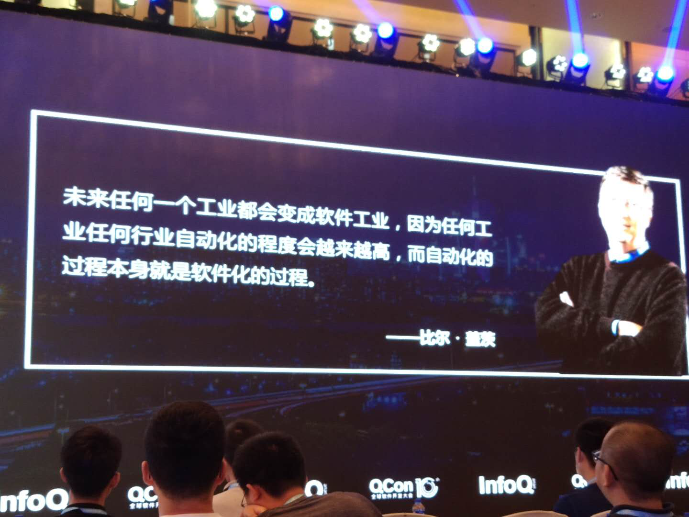

### 4.2 阿里中台战略在大文娱的演进之路（陈翌）
#### 4.2.1 文娱产品的背景介绍
&emsp;&emsp;首先通过介绍文娱产品的特点：文娱产品离不开用户文化特征和代际特征，文化现象包括前喻文化（即经验文化，也称为老年文化）、后喻文化（主要依靠创新）、并喻文化（经验与创新并进）。分析互联网文化群落，主要是游戏玩家、屌丝、二次元、宅等。之后谈到了文化演进，各类文化系的发展。  
&emsp;&emsp;在谈完上述文娱业务之后，开始介绍阿里文娱的产品，主要依靠大麦网和优酷，整体上是大而不强，业务发展通过协同，依靠收购、打通、整合。  
&emsp;&emsp;由于用户需求变化、用户兴趣转移、应用场景变化，需要进行生态延展和扩张。  

#### 4.2.2 文娱中台的目标与难点
&emsp;&emsp;阿里文娱中台的目标是输出关键能力，采用C端与B端结合的方式：C端主要的目标是统一体验设计、差异产品价值、业务经营、运营、分析支撑，B端主要的目标是文娱新基础设施。  
&emsp;&emsp;文娱中台的难点：关于2B和2C的统一，新的内容表现形式的变革，泛文娱的边界越来越模糊，技术发展带来的机会巨大。  
&emsp;&emsp;文娱中台致力于服务快速变化的文娱产品。  

#### 4.2.3 文娱中台的架构
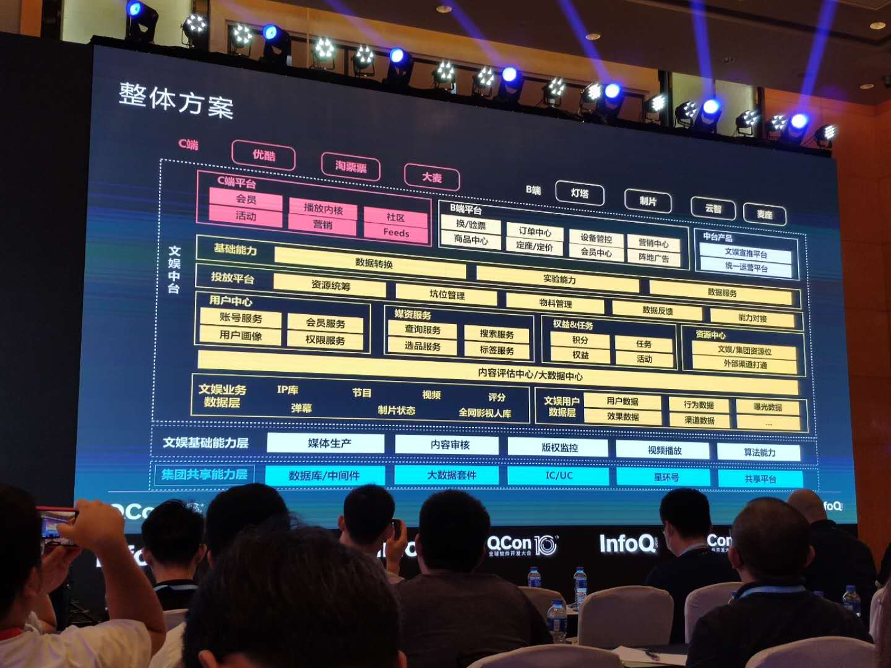

#### 4.2.4 文娱中台必须具备的三种能力
1. 内容理解与组织  
&emsp;&emsp;主要通过内容主观标签，比如年代、演员，视频稀疏度的调整；内容客观标签，比如图像内容、字幕，用来提高用户命中率。多态视频搜索：通过文本、图像、音频生成视频，进行多态视频搜索。在门户首页，针对视频主要有两种模式：主动搜索（用户行为），智能视频搜索（用户标签、行为计算方式、深度学习网络）。对于内容理解，目前主要通过三种手段：人（主观度），机器+AI（识别高），机器。
2. 高清与交互  
&emsp;&emsp;生成高清视频、长短视频相互生成、广告植入的交互。
3. 数据智能  
&emsp;&emsp;主要用于智能生产——生产作业（视频封面），通过两种手段来实现：直接截屏、美化图像。

### 4.3 数字化转型提升企业核心竞争力——“云”会吞噬一切（乔新亮）
&emsp;&emsp;本演讲主要通过介绍提升企业和个人核心竞争力，采用数字化转型的方案，增强企业的核心竞争力。  
&emsp;&emsp;首先介绍了数字化转型的九死一生，在企业数字化转型中有两种类型：连续性固化型思维、非连续性成长型思维。所有企业在数字化转型的过程中，面向项目的管理都会转向面向产品的管理。  
&emsp;&emsp;之后描述了两种曲线的特点，第一曲线：用户体验驱动的产品优化，第二曲线：体系思维，全局视角，舍九取一。演讲人举两个例子，微软的产品从Windows到云，NetFlex从DVD到数字化交互。  
&emsp;&emsp;然后介绍了数字化转型参考架构图和参考组织图，并得出数字化转型需要的文化（即目标）：追求卓越、负责任的人更自由、鼓励试错、高绩效。推出结果是云会吞噬一切，将云提高到新的层次。  
&emsp;&emsp;接下来着重阐述了云的方向及特点：Physical less、Operational less、Technical less。  
&emsp;&emsp;从上可得到企业的核心竞争力其实就是通过对云的认知和实践去提升。  
&emsp;&emsp;那么要如何提升个人核心竞争力呢？对工作中所做的产品要面向functional、面向logical、面向application。用最终眼光去看两个选择：做云、用云。需要培养思维能力和思辨能力，架构思维、设计思维和产品思维三方面的学习能力。  
&emsp;&emsp;最后总结了企业的核心竞争力提升需要左手认知，右手实践。  

### 4.4 百万级复杂业务Ops系统建设——基于事件的智能运维体系（郑旭东）
&emsp;&emsp;本讲座的重点在于基于弹性计算的ECS云服务主机的创建的智能运维，来解决百万级复杂业务场景。

#### 4.4.1 目标分析
&emsp;&emsp;首先分析系统的目标，要得到系统的目标，必须了解客户需要什么，客户追求的是幸福感和安全感，通过客户Buyer/User的稳定需求层次的分析，得到系统需要“稳”。  
&emsp;&emsp;所谓客户的稳定需求层次，从上到下分别是可预测、可编排、可控制、可感知、稳定可靠基础。  
&emsp;&emsp;针对此目标，我们希望提供的能力有性能、价格、客户适配、客户维护。从硬件研发、硬件维护过渡到产品研发和产品维护，适配成本采用一次性投入，系统的稳定性是客户的零成本产品研发，能为客户提供零成本的系统搭建和运维。  

#### 4.4.2 难点
&emsp;&emsp;关于ESC云服务主机的弹性创建和运维，业务复杂性是一大难点，其规模也是亚洲第一大规模，小概率事件必然发生，异常相互影响。  
&emsp;&emsp;上下游几十个系统，对外数百个性能、功能指标、维系统，当前没有什么横向运维系统能支持这么复杂的业务场景。  
&emsp;&emsp;基于该难点，需要构建量化指标来衡量系统的稳定性。  
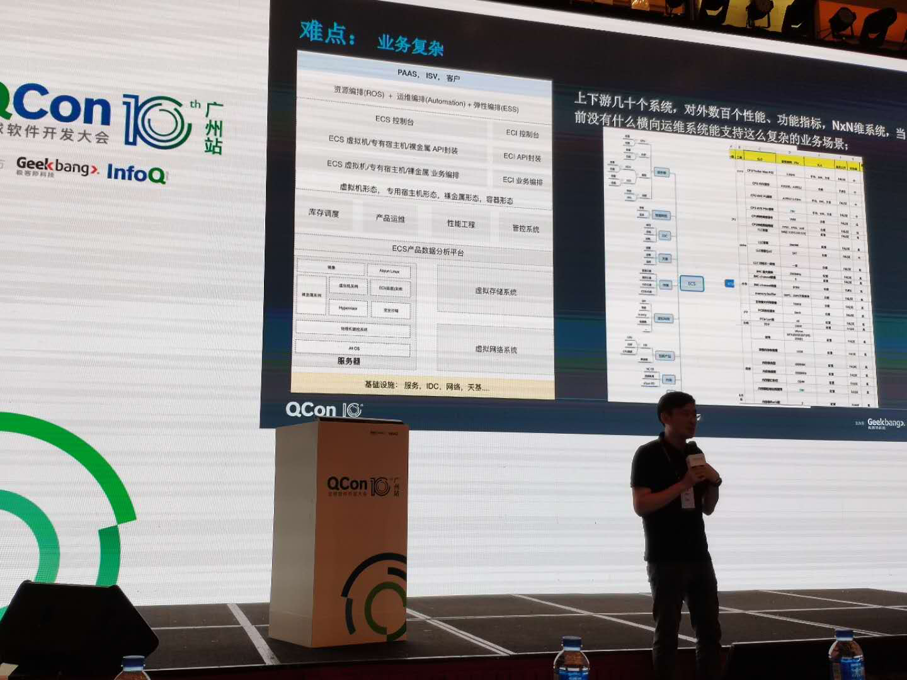

#### 4.4.3 量化问题——构建量化指标
&emsp;&emsp;首先构建客户伤害指标，其目的就是量化安全感。
，所有的影响一定要有业务权重，异常对于客户影响，一定是业务权重和时间的积分量。构建客户伤害指标，
&emsp;&emsp;之后分析服务器的性能情况：宕机、夯机、性能波动。
- 宕机：无差别，毁灭性打击，客户业务100%中断，所有未持久化数据丢失！
- 夯机：核心功能受损，未持久化数据暂未丢失，客户业务时断时续，长期夯机，客户业务僵死；有可能自动恢复正常。
- 性能波动：业务稳定性受影响，业务高峰期可能引起系统雪崩，客户对阿里云失去信任。

&emsp;&emsp;针对服务器性能的三个分类，可得到一系列的量化指标：
$$
\text{宕机率} = \frac{ \text{宕机影响客户}vCPU \text{加权个数}}{\text{所有客户总保有的}vCPU \text{加权个数}}
$$
$$
\text{Phase1: 夯机率} = \frac{ \text{夯机影响客户}vCPU \text{加权个数}}{\text{所有客户总保有的}vCPU \text{加权个数}}
$$
$$
\text{Phase2: 夯机率} = \frac{ \text{夯机影响客户}vCPU \text{加权个数} \times \text{夯机影响加权时长}}{\text{所有客户总保有的}vCPU \text{加权个数} \times \text{总使用时长}}
$$
$$
\text{性能波动率} = \frac{\text{性能波动幅度} \times \text{影响客户} vCPU \text{加权个数} \times \text{影响加权时长}}{\text{所有客户总保有的} vCPU \text{加权个数} \times \text{总使用时长}}
$$

#### 4.4.4 解决问题
&emsp;&emsp;通过构建通用的Ops系统，其目标是一次建设，全业务场景复用，让业务和底层基础设施解耦，加速业务开发。  
&emsp;&emsp;在ECS上搭建通用Ops系统，通过运维工具进行简单监控，ECS调度模块对ECS上的物理资源进行调度，采用定时任务、工作流、业务规则三者结合，对物理机、售卖资源、库存、用户以及其他资源进行调度，提高系统稳定性。  
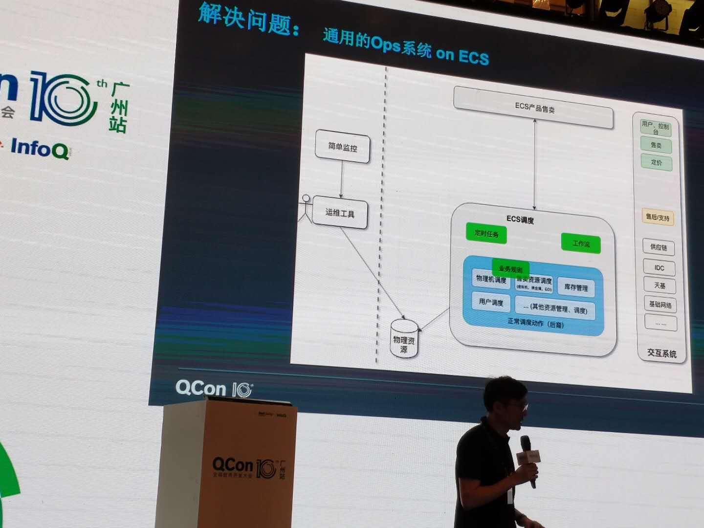

#### 4.4.5 构建以事件为中心的ECS异常调度体系
&emsp;&emsp;以事件为中心，统一交互平面；松耦合，快速扩张。对物理网络安全链路、物理机硬件监控、IDC工单、块存储监控、虚拟网络监控、ECS业务监控、ECS运维监控、飞天监控等业务进行异常检测，让其通过调度系统与Customer进行分离，采用开发者->第三方开发者->客户的自动识别机制进行系统构建。  
&emsp;&emsp;建立该异常调度体系的目的是异常调度，业务规则统一，通过以下几点建立统一的规则：异常调度（所有运维场景本质上是资源的异常调度）；业务规则统一（异常/正常调度复用一套业务规则，异常调度能力本来就应该是ECS产品的核心能力）；资源操作统一（原子操作统一，正常和异常调度统一入口，解决资源、信息不一致为）；事件闭环（操作对象通过事件和系统交互，形成闭环）。  
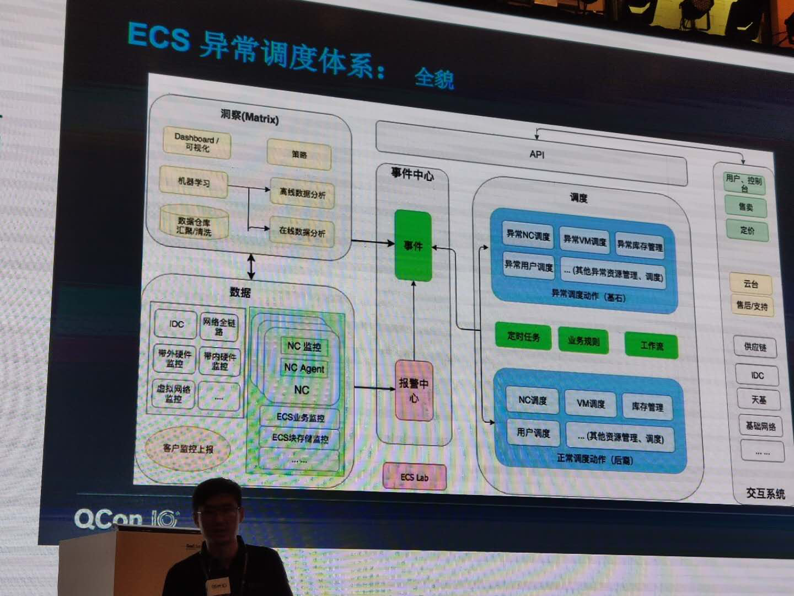

&emsp;&emsp;采用系统事件驱动，构建ECS客户侧运维体系，主要通过主动运维、诊断复盘、全链路定界和交互、形成自动化运维闭环。通过系统检测，80%以上的客户在利用系统事件做异常规避！  
&emsp;&emsp;对这几个方法进行详细说明：  
- 主动运维：基于阿里云大规模智能运维和故障分析预测，提前感知隐患并优先热迁移，针对不适合热迁移的实例发布计划事件，规避故障对用户业务连续性的风险。
- 诊断复盘：系统事件反映实例因各类原因引起的实例状态变化，历史事件记录帮助用户进行复盘分析。
- 全链路定界和交互：支持控制台、OpenAPI、实例元数据、云监控等多种交互媒介，同时满足人工操作和程序化处理机制。
- 形成自动化运维闭环：事件数据通过云监控的事件监控和转发，方便对接云产品OpenAPI和用户自定义运维操作，让无人值守ECS成为可能。
- 驱动更强健的基础组件建设：采用数据&智能，能够发现异常模型；采用数据&模型，能够指导我们的数据中心，基础设施的高效，快速迭代。

### 4.5 语音翻译技术进展及应用（王进士）
#### 4.5.1 语音翻译的起源与定义
&emsp;&emsp;通过巴别塔的传说，介绍语音翻译的起源，目的是要重建巴别塔之路。什么是语音翻译？语音翻译就是通过集成语音识别、机器翻译及语音合成等技术实现不同语言使用者之间的语音沟通无障碍。通过语音输入->语音识别->机器翻译->语音合成->语音输出，在语言翻译中，行业术语更为困难。  
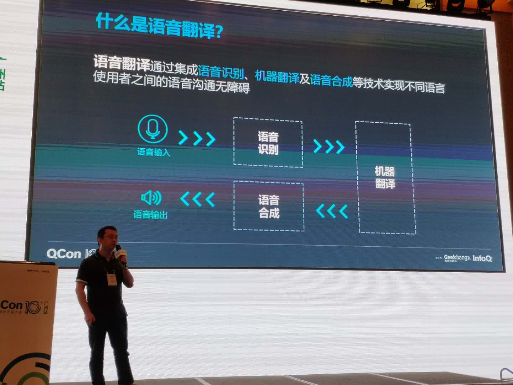

#### 4.5.2语音翻译业界现状
&emsp;&emsp;2014年12月微软发布西班牙英文翻译功能到2018年4月讯飞翻译机2.0发布，口语交流等相对简单场景，语音翻译已经突破应用门槛，口语交流等面临较大时长，语音翻译产品不断涌现！  

#### 4.5.3智能语音核心技术进展
&emsp;&emsp;语音技术突破的关键因素在于深度学习、云计算和大数据，它们三者的共同作用可起到涟漪效应。  
&emsp;&emsp;语音识别的主要技术路线：语音识别技术从1980年开始，第一代语音识别采用GMM-HMM算法，一直过了30年，到2010年，第二代语音识别采用NN-HMM hybrid深度学习算法达到比较好的效果，静讲的识别率提高，到了2017年第三代语音识别采用Encode-Decode技术，使得混讲的识别率得到提升。  
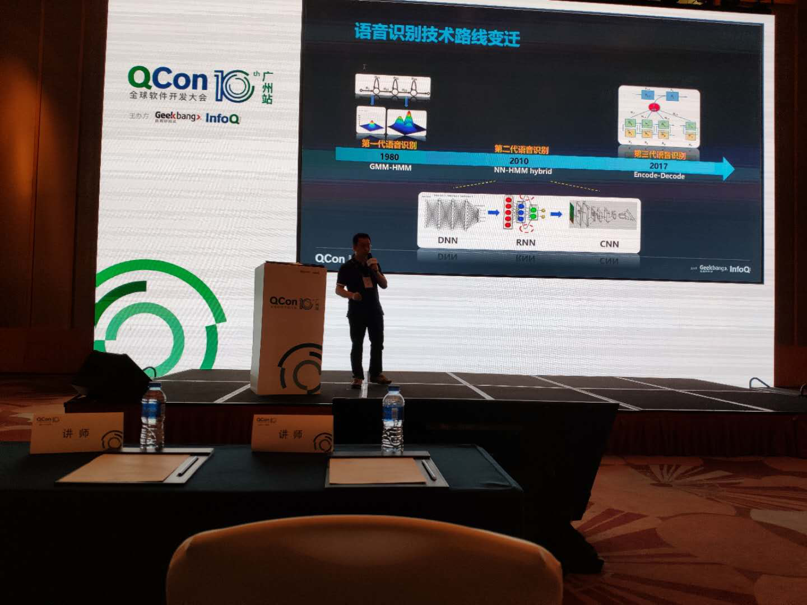

&emsp;&emsp;科大讯飞在2018年9月，CHIME-5国际语音识别比赛获得全部四个项目的冠军，挑战了史上最难语音识别任务，分别是厨房和起居室场景，该场景的困难在于对话风格非常自由，近乎随意，大量的语音重叠，远场混响，噪声干扰，多麦克风阵列的同步录音，使得语言识别的难度大大提升。语音识别覆盖语种范围持续突破：中文普通话识别率达到98%；覆盖国内24种方言；民族语言方面，率先推出高可用的维语识别和藏语识别；多语种识别方面，相继推出英文、日语、韩语、俄语等语音识别技术。  
&emsp;&emsp;语音合成主要技术路线：最早语音合成主要采用小词汇量波形拼接技术，后来采用大规模语料库波形拼接技术，将语音和文字切分生成一系列小词汇量的波形，扩充语料库，这就是基于统计语料库拼接合成技术。目前采用的是Encode-Decode技术，个性化语音通过语音动作（唇形等）合成语音，这就是基于参数建模的语音合成技术：对语音的频谱特征参数建模，生成参数合成器来构建文本序列到语音的映射关系。  
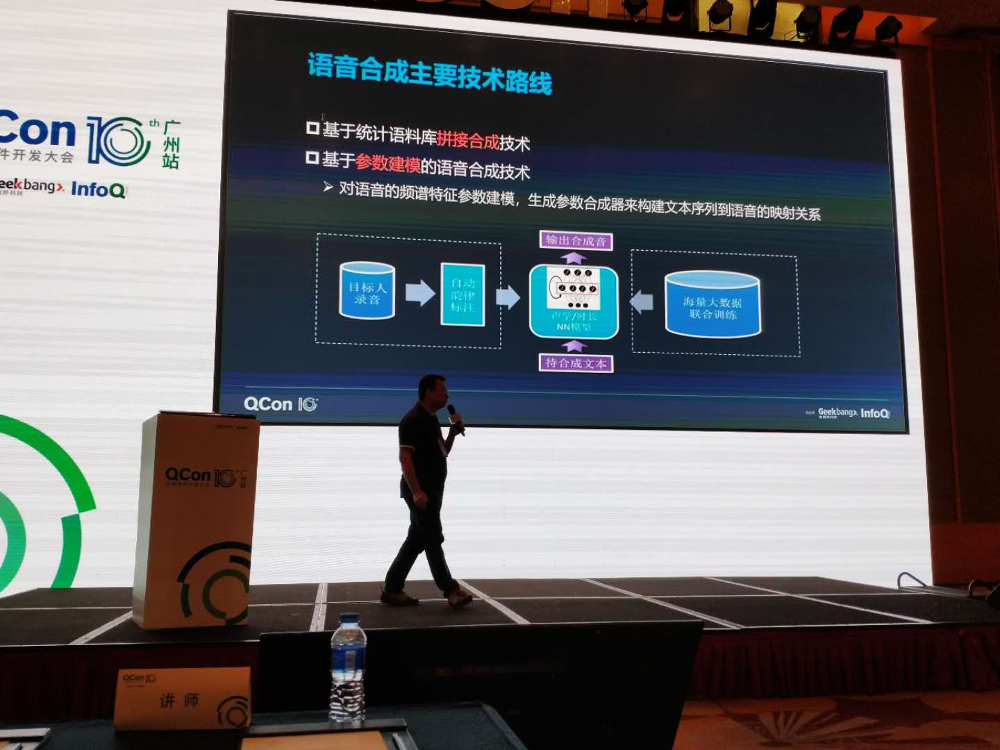

#### 4.5.4 机器翻译近期进展
&emsp;&emsp;机器翻译技术发展历史：从1980年基于规则的机器翻译开始，到1993年，IBM提出基于词统计翻译模型，2003年，Koehn提出基于短语的统计翻译模型，再到2014年，谷歌和蒙特利尔大学提出端到端神经机器翻译，2015年蒙特利尔大学引入Attention机制，2017年谷歌发布transformer系统。  
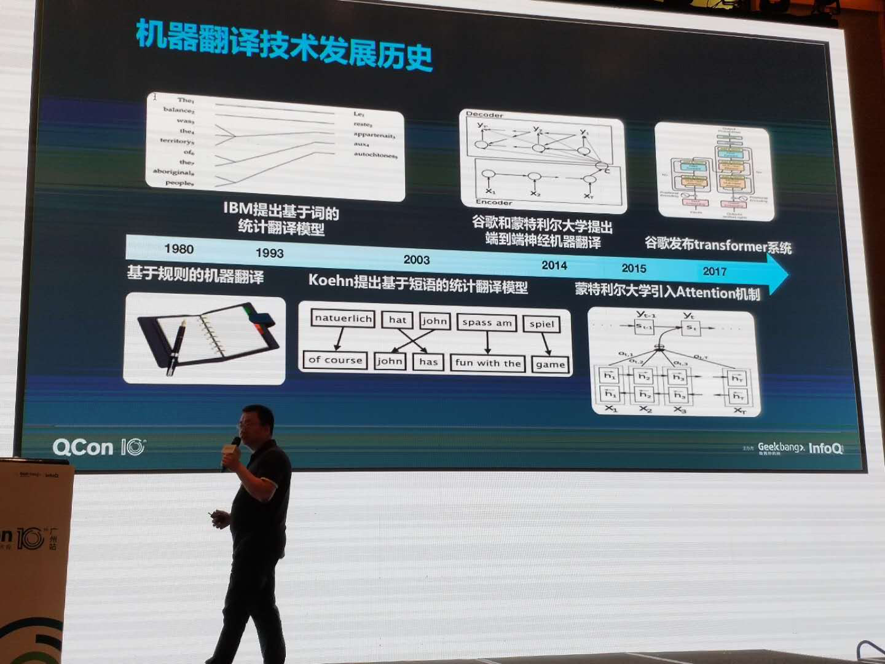

&emsp;&emsp;机器翻译主要面临的问题就是一词多义和语序，在统计机器翻译技术中，采用源短语切分、源短语翻译、目标短语调序三个过程，从词的翻译到短语的翻译，优点是可解释性高、可干预度高（比如百度翻译）、计算快，基于平行预料直接训练翻译模型，可实现量产；推动了以谷歌为代表的工业界大规模商业应用。但缺点也是很明显的，需要专家人工设计特征，建模能力不足，调序困难，翻译生硬（比如有道的机器翻译），离散表示法带来严重的数据稀疏。  

#### 4.5.5 语音翻译应用面临的问题
&emsp;&emsp;语音翻译应用场景主要有交替传译、同声传译、End to End翻译。  
&emsp;&emsp;交替传译面临的问题，所谓交替传译就是一句一句的交替翻译，主要有网络问题，具体口语旅游场景下，网络连接是痛点；领域专业，行业应用是机器翻译发展的关键；口音方言，解决识别错误带来的级联影响。  
&emsp;&emsp;采用多种策略融合的离线翻译方案：采用模型裁剪、定点量化、Teacher-Student训练等技术，实现本地翻译。  
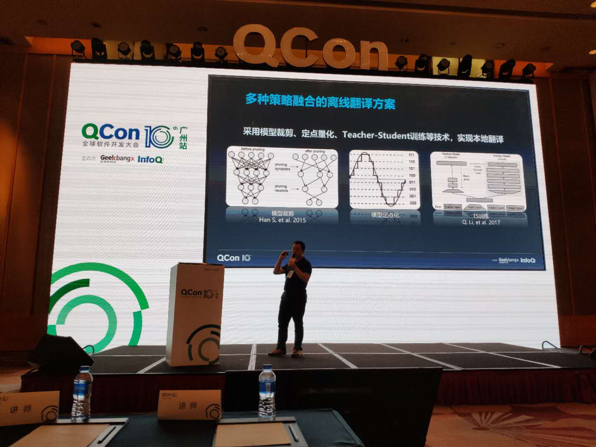

&emsp;&emsp;行业翻译技术解决方案：通过分领域建模、自适应训练、数据选择等技术提升行业翻译效果。  

#### 4.5.6 语音翻译面临的主要挑战
1. 基于深度学习的口语翻译性能得到了大幅度提升；
2. 部分语种在口语旅游等相对简单的场景下，达到了实用化门槛；
3. 实际应用还是面临一些难题，主要表现在：
    - 复杂场景下语音识别错误率影响问题（如远场/噪声）
    - 机器翻译中命名实体和集外词/低频词翻译问题
    - 神经机器翻译系统复杂句式多翻和漏翻问题
    - 大量小语种语音识别和机器翻译数据资源稀缺问题

#### 4.5.7 语音翻译未来技术发展趋势
1. 复杂环境下语音识别
2. 低资源语音翻译技术
3. 端到端语音翻译技术

### 4.6 从菜鸟到架构师，漫谈架构师成长（李运华）
#### 4.6.1 架构师画像
- 架构设计核心理念：主要是思维模式+设计原则。  
- 思维模式：判断、取舍、创造。  
- 设计原则：合适原则、简单原则、演进原则。  
- 建筑的目标是为了达到永恒，比如长城、金字塔。而软件是变化的，架构师需要适应变化，需要不断演进架构。  

#### 4.6.2 架构师成长
&emsp;&emsp;架构师的成长路线：工程师->高级工程师->技术专家->初级架构师->中级架构师->高级架构师。
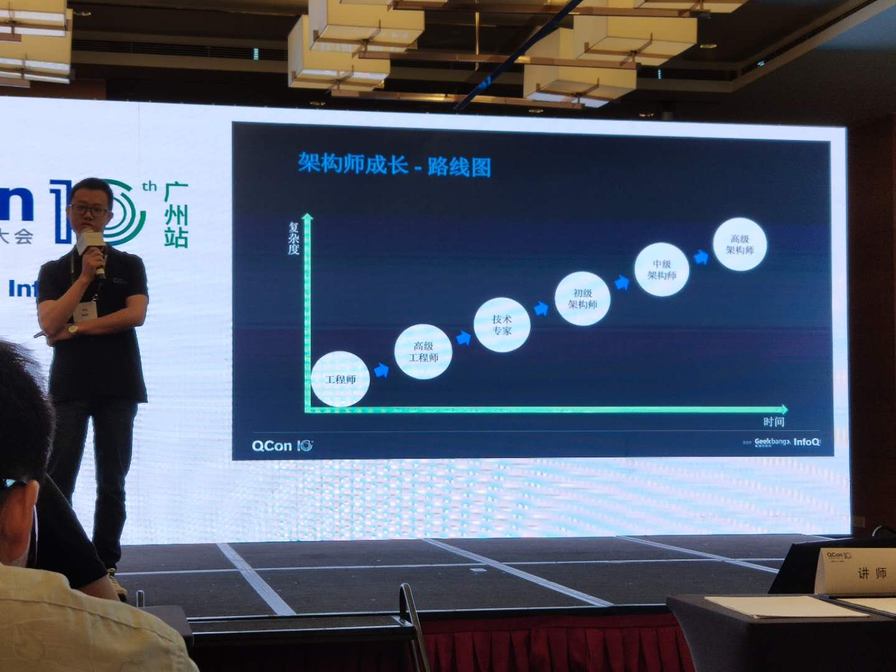

1. 工程师阶段（1-3年），重点是基础。采用碎片化时间，系统化学习，经典书籍系统学习。在这个阶段，不建议的是三大坑（编译原理、XX内核代码、XX算法代码）
2. 高级工程师阶段（3-5年），重点是经验（业务、套路、原理），熟悉业务，将方法进行套路化（即过程化），熟悉原理。撞我基础原理：JVM、开源软件等，学习套路：分库分表、缓存、SOLID（设计原则）、设计模式、MVP等。在这个阶段，不建议的是贪大求全，看了很多，但都是蜻蜓点水。
3. 技术专家阶段（4-8年），重点是技术深度+宽度。熟悉核心源码：成熟的开源软件，Memcached、Redis、Nginx、Netty等，业务交流：参加技术大会，关注大厂技术。在这个阶段，不建议的是生搬硬套，直接拷贝大厂技术。
4. 初级架构师阶段（5-10年），重点是复杂度驱动，风险驱动，DDT。架构对比，架构重构，需要业务理解，集中力量，多分步骤实现。在这个阶段，不建议的是过分依赖以往成功经验。
5. 中级架构师阶段（8+年），重点是技术本质，熟悉掌握理论、算法、原理。掌握技术理论：CAP、BASE、分布式快照算法等，技术原理：磁盘（Kafka）、CPU和内存（Disruptor）等。在这个阶段，不建议的是好大喜功、过分设计、炫技式设计（三高设计模式）。
6. 高级架构师阶段（10+年），重点是创造，结合业务和技术，实现一种架构的文化。
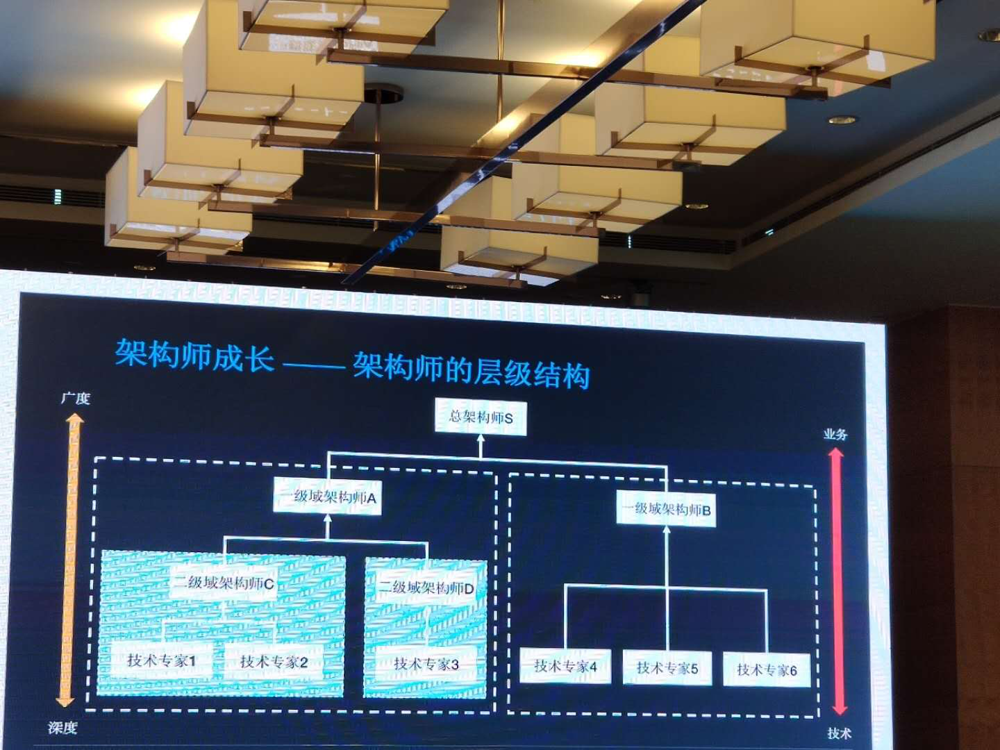

#### 4.6.3 架构师的常见疑惑
1. 通过自己领域积累知识，学习->思考->提炼->方法论
2. 高效学习，安装->配置运行->原理研究->Demo测试->核心源码

## 5 参会总结
&emsp;&emsp;本次参加会议，接触了华为、汇丰、腾讯、阿里一些大厂的技术践行者，也和他们讨论了一些学习法和技术思路。  
&emsp;&emsp;阿里优酷视频的在线决策，最早在优酷被阿里收购之前，由于云计算的算力限制，导致在线决策的效果很差，有的时候甚至是写死视频推荐，千人千面的推荐效果差，在加入阿里之后，底层代码采用了阿里的分层计算，特征工程与模型彻底分离，在算法应用中，也做到服务云化。  
&emsp;&emsp;笔者早在刚刚接触计算机的时候，就觉得架构师特别厉害，在看完李运华（华仔）的《从0开始学架构》，感觉对技术的学习有了方法，正如QCon大会，华仔在演讲中说的那样，思维模式+设计原则才是架构设计的核心。思维模式使得学习的效率得到提升，而设计原则，在一些代码模块编写以及系统架构设计时，也对笔者帮助很大。  
&emsp;&emsp;本次大会值得推荐的是“语音翻译技术进展及应用”和“从菜鸟到架构师，漫谈架构师成长”，由于这两个没有视频和PPT，如果大家需要PPT学习的话，可以参考笔者所上传的照片。语音翻译介绍了技术进展，虽然不是那么有深度，没有介绍语音翻译的算法，但是对于了解该行业的发展，拓宽学习方法有很大帮助。从菜鸟到架构师，这个演讲相当于分享类讲座，由于笔者专注于学习，在其他实践领域并是擅长，这个讲座，对于笔者未来的架构师成长还是指明了思路，并避开了一些隐坑。发现华仔讲的和Bob大叔的那本《架构整洁之道》很多相似之处。比如架构师也应该工作在一线，与代码紧密联系，同样强调SOLID设计原则，同样重视理论和原理。  
&emsp;&emsp;本次大会，对未来的学习和技术实践还是有一定帮助的，但是笔者还是要吐槽几句的，大部分的讲座都在介绍自家的产品，比如阿里的《阿里巴巴超大规模微服务实践》就是在介绍自家的平台，不过看上去也就是在Spring Boot Starter进行了封装和整合，建立了一个公司内部的应用创建与发布平台。  

## 6 附件
高清视频（约32G）和PPT：  
链接：https://pan.baidu.com/s/1nBnomU4VNeyev3zOZgVW7g   
提取码：wxwb   
链接如果失效，请联系笔者，笔者将重新更换新的分享链接。  